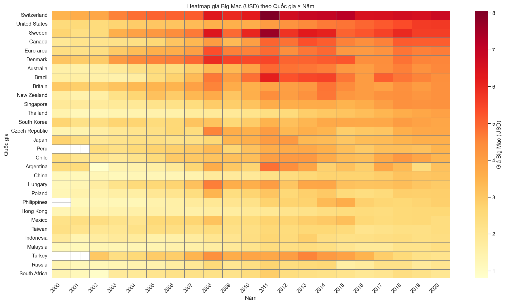
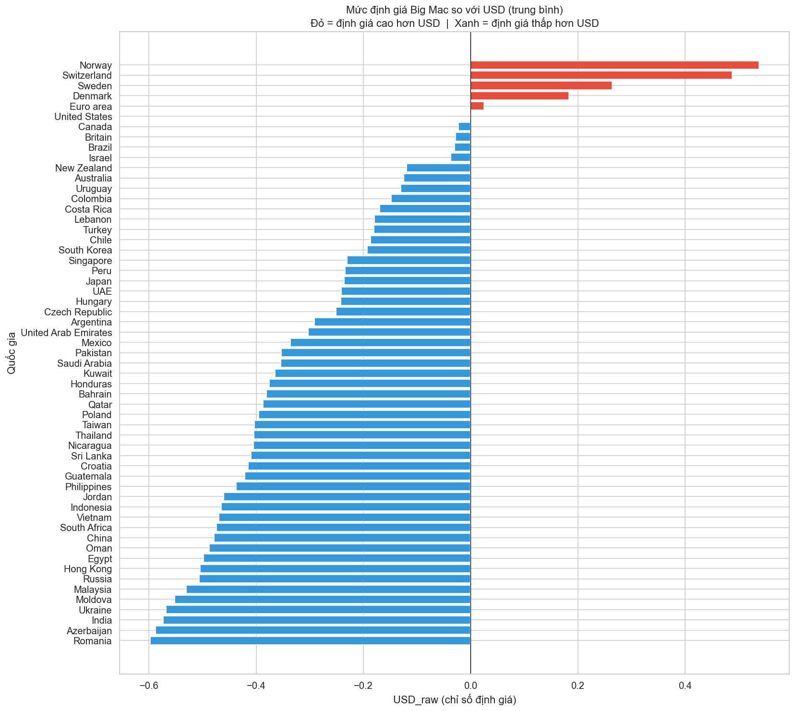
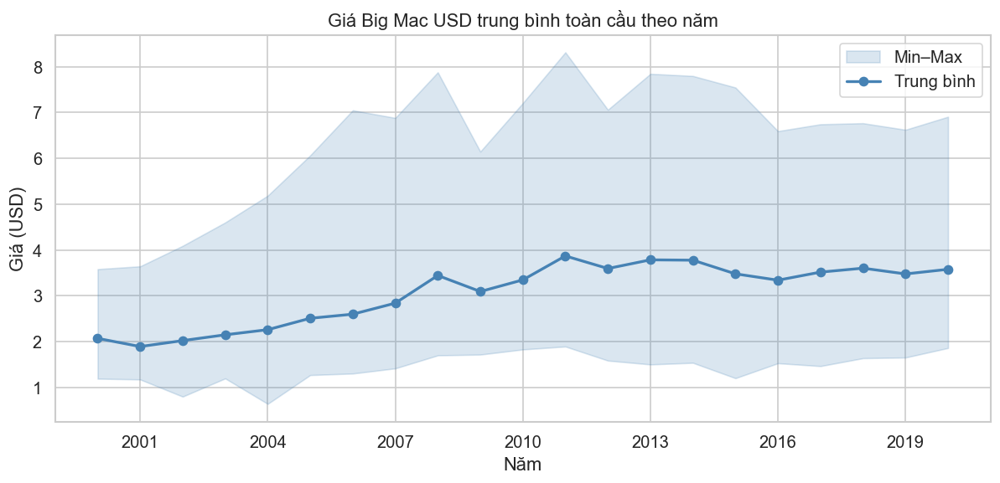
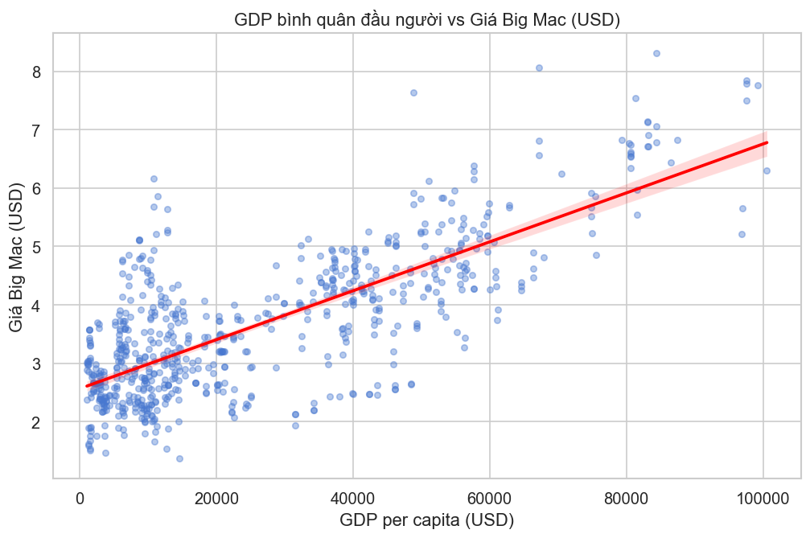

<!-- _class: cover -->

# 🍔 Big Mac Index Dashboard

## Phân tích & Trực quan hóa dữ liệu

**Chapter 19 — The Economist Big Mac Index**

*Môn học: Trực quan hóa Dữ liệu*

---

<!-- _class: section-break -->

## 1. Giới thiệu Dashboard

*Dashboard được phân tích là gì?*

---

## Dashboard: Big Mac Index — The Economist

**Dashboard gốc:** [The Economist – Big Mac Index](https://www.economist.com/big-mac-index)

**Mục đích:**
So sánh giá trị tương đối của các đồng tiền dựa trên giá một chiếc Big Mac — phiên bản đơn giản hóa của lý thuyết **PPP (Purchasing Power Parity)**.

**Dữ liệu sử dụng:**
- Giá Big Mac tại **57 quốc gia**
- Tỷ giá hối đoái so với USD
- GDP bình quân đầu người
- Lịch sử **2000 – 2020** (~1,386 quan sát)

| Cột dữ liệu | Ý nghĩa |
|---|---|
| `dollar_price` | Giá quy đổi USD |
| `USD_raw` | Mức định giá thô so USD |
| `GDP_dollar` | GDP per capita |
| `adj_price` | Giá điều chỉnh theo GDP |

 

> **USD_raw > 0** → đồng tiền đắt hơn USD  
> **USD_raw < 0** → đồng tiền rẻ hơn USD

---

<!-- _class: section-break -->

## 2. Mục tiêu của Visualization Dashboard

*Dashboard trả lời những câu hỏi gì?*

---

## Mục tiêu Dashboard

Dashboard được xây dựng để trả lời **4 câu hỏi cốt lõi:**

| # | Câu hỏi | Biểu đồ hỗ trợ |
|---|---|---|
| ① | Đồng tiền quốc gia nào đang bị **định giá cao / thấp** so với USD? | Choropleth Map · Bar Chart |
| ② | Sự khác biệt này **thay đổi thế nào** theo thời gian? | Timeline · Animation |
| ③ | **Mối liên hệ** giữa mức phát triển kinh tế và giá Big Mac? | Scatter Plot |
| ④ | Có **xu hướng khu vực địa lý** nào không? | Map · Multi-line Chart |

 

**Giá trị mang lại:**

> Đơn giản hóa khái niệm PPP → giúp người dùng *không có nền kinh tế* cũng hiểu được định giá tiền tệ toàn cầu

---

<!-- _class: section-break -->

## 3. Story của Dashboard

*Câu chuyện dữ liệu muốn kể — phần quan trọng nhất*

---

## Story chính

> *"Giá của cùng một sản phẩm trên toàn thế giới phản ánh sự khác biệt về sức mua và giá trị đồng tiền — và sự khác biệt đó không ngừng thay đổi theo thời gian và mức phát triển kinh tế."*

 

Dashboard kể câu chuyện này theo **luồng tuyến tính 4 bước**, mỗi bước trả lời một câu hỏi và dẫn dắt sang câu hỏi tiếp theo:

<b>① Nhìn toàn cầu</b>
Quốc gia nào đắt / rẻ bất thường? <em>(Map)</em>

<b>② So sánh trực tiếp</b>
Ai overvalued / undervalued nhất? <em>(Bar)</em>

<b>③ Theo dõi lịch sử</b>
Thay đổi thế nào qua các năm? <em>(Line)</em>

<b>④ Tìm nguyên nhân</b>
GDP có giải thích được không? <em>(Scatter)</em>

---

## Story — Ví dụ cụ thể

Câu chuyện mà dashboard kể qua dữ liệu thực:

**Bước ①:** Nhìn bản đồ → Bắc Âu (Norway, Switzerland) màu đỏ đậm, Đông Nam Á (Vietnam, Malaysia) màu xanh đậm → *"Có sự phân cực rõ ràng giữa các khu vực"*

**Bước ②:** Bar chart → Norway +53.8%, Romania −59.8% → *"Khoảng cách định giá lên tới hơn 100%"*

**Bước ③:** Timeline → Giá Big Mac toàn cầu tăng đều từ 2000–2020, Mỹ tăng từ $2.5 → $5.7 → *"Đây là phản ánh của lạm phát tích lũy"*

**Bước ④:** Scatter → tương quan dương rõ ràng giữa GDP per capita và giá Big Mac → *"Quốc gia giàu hơn thì Big Mac đắt hơn — đúng như PPP dự đoán"*

---

<!-- _class: section-break -->

## 4. Các lựa chọn hiển thị

*Tại sao chọn biểu đồ đó — và nó phản ánh Story ra sao?*

---

## 4.1 — Choropleth Map (Bản đồ thế giới)

**Mục đích:** Cái nhìn tổng quan toàn cầu ngay lập tức

**Tại sao chọn Map?**
- Bố cục địa lý giúp nhận biết **xu hướng theo vùng** trực giác
- Màu diverging (đỏ–xanh) encode hai chiều overvalued / undervalued
- Người dùng không cần đọc số — nhìn màu là hiểu

**Phản ánh Story thế nào?**
> Map là **cổng vào của câu chuyện** — thực hiện **Bước ①** (tổng quan toàn cầu), đặt câu hỏi cho các bước tiếp theo.

*Heatmap Quốc gia × Năm — cùng logic màu sắc với choropleth*

---

## 4.2 — Sorted Bar Chart (Xếp hạng)

**Mục đích:** Xếp hạng định giá giữa các quốc gia

**Tại sao chọn Bar Chart?**
- Con người so sánh **chiều dài** tốt hơn góc hay diện tích
- Sắp xếp từ thấp → cao làm lộ rõ top & bottom
- Màu đỏ / xanh giúp tách nhóm over / undervalued ngay lập tức

**Phản ánh Story thế nào?**
> Thực hiện **Bước ②** — chuyển từ "vùng nào" sang "cụ thể quốc gia nào" và "chênh lệch bao nhiêu phần trăm."

---

## 4.3 — Line Chart (Timeline)

**Mục đích:** Diễn biến giá theo thời gian

**Tại sao chọn Line Chart?**
- Phù hợp nhất cho **dữ liệu chuỗi thời gian liên tục**
- Min–Max shading thể hiện mức độ phân tán toàn cầu
- Multi-line cho phép so sánh nhiều quốc gia trên cùng trục

**Phản ánh Story thế nào?**
> Thực hiện **Bước ③** — bổ sung chiều thời gian, trả lời câu hỏi "định giá có thay đổi theo năm không?" và phát hiện các sự kiện kinh tế (khủng hoảng 2008).

---

## 4.4 — Scatter Plot (GDP vs Định giá)

**Mục đích:** Khám phá mối quan hệ GDP ↔ Giá Big Mac

**Tại sao chọn Scatter Plot?**
- Hiển thị **tương quan giữa 2 biến số** liên tục trực tiếp
- OLS trendline giúp nhìn thấy xu hướng dù có nhiều outlier
- Phân màu theo khu vực → nhận biết pattern vùng địa lý

**Phản ánh Story thế nào?**
> Thực hiện **Bước ④** — đây là slide "giải thích nguyên nhân," kết thúc vòng lặp nhận thức: *tại sao Bắc Âu đắt hơn? Vì GDP cao hơn.*

---

<!-- _class: section-break -->

## 5. Ưu điểm của Dashboard

---

## Ưu điểm

**① Kể chuyện dữ liệu tốt (Data Storytelling)**
Luồng Global → Country → History → Cause dẫn dắt người dùng từ tổng quan đến nguyên nhân một cách tự nhiên, không cần hướng dẫn.

**② Multiple Coordinated Views — nhiều góc nhìn cùng dữ liệu**
Map · Ranking · Timeline · Correlation bổ sung cho nhau trên cùng một trang, không cần chuyển màn hình.

**③ Tương tác trực quan (Interactivity)**
Hover · Click · Drill-down cho phép người dùng khám phá theo hướng mình quan tâm — tuân thủ nguyên tắc *Details on Demand*.

**④ Thiết kế tối giản, không gây cognitive overload**
Ít màu · Ít KPI · Không noise — tuân thủ nguyên tắc *data-ink ratio* của Tufte. Người dùng không chuyên vẫn đọc được.

---

<!-- _class: section-break -->

## 6. Nhược điểm của Dashboard

---

## Nhược điểm

**① Map không tối ưu cho so sánh chính xác**
Khó phân biệt chênh lệch 10% và 15% chỉ bằng màu sắc. Các nước nhỏ (Singapore, Bahrain, Qatar) gần như vô hình trên bản đồ.

**② Thuật ngữ kỹ thuật không có giải thích**
PPP · Overvalued · Undervalued · USD_raw — dashboard gốc không có tooltip hay chú thích, tạo rào cản với người dùng không có nền kinh tế.

**③ Chỉ dựa trên một sản phẩm duy nhất**
Big Mac không phổ biến ở mọi quốc gia · Công thức thay đổi theo thị trường → chưa phản ánh toàn diện sức mua của nền kinh tế.

**④ Thiếu bộ lọc linh hoạt**
Không thể lọc theo khu vực địa lý, mức GDP, hoặc khoảng năm → hạn chế khả năng phân tích nhóm và so sánh có mục tiêu.

---

<!-- _class: section-break -->

## 7. Đề xuất cải tiến

*Chúng tôi đã xây dựng và demo trực tiếp*

---

## Cải tiến đã triển khai

**① KPI Summary** — 5 metric cards tóm tắt tức thì: Most Overvalued · Most Undervalued · Global Avg · Avg Price · # Countries. Người dùng nắm big picture chỉ sau 5 giây, không cần đọc biểu đồ.

**② Glossary — Giải thích thuật ngữ** — Expandable section giải thích Big Mac Index · PPP · USD_raw · Adj. Price ngay trên dashboard. Giải quyết trực tiếp nhược điểm ②.

**③ Bộ lọc đa chiều** — Year range slider · Multiselect 8 khu vực · Mức GDP (Thấp / TB / Cao). Toàn bộ biểu đồ cập nhật tức thì. Giải quyết trực tiếp nhược điểm ④.

**④ Animation Choropleth** — Nút ▶ Play chạy bản đồ qua từng năm 2000–2020. Quan sát sự thay đổi toàn cầu theo thời gian mà dashboard gốc không có.

---

## Demo — Interactive Dashboard

 

> `streamlit run app.py` → **http://localhost:8501**

 

<b>Tab 1</b>
🗺️ Animated Choropleth
 <small>Cải tiến ④</small>

<b>Tab 2</b>
📊 Sorted Bar + Filter
 <small>Cải tiến ③</small>

<b>Tab 3</b>
📈 Multi-country Timeline
 <small>Cải tiến ③</small>

<b>Tab 4</b>
💰 GDP vs Valuation
 <small>Cải tiến ①②</small>

---

<!-- _class: cover -->

## Kết luận

 

> *Big Mac Index Dashboard là ví dụ điển hình của một dashboard thành công vì sử dụng nhiều kỹ thuật visualization khác nhau để kể một câu chuyện kinh tế đơn giản nhưng giàu ý nghĩa.*

 

Dashboard thể hiện tốt các nguyên tắc thiết kế:

**Overview first · Details on demand · Multiple coordinated views**

 

*Cảm ơn thầy/cô và các bạn đã lắng nghe!* 🍔

---

<!-- _class: section-break -->

## Phụ lục — Q&A

*Câu hỏi thường gặp*

---

## Q1: Tại sao Bắc Âu đắt hơn — vì GDP cao hơn?

**Cơ chế:** GDP cao → lương cao → chi phí lao động địa phương cao → giá Big Mac cao

> Không phải thịt bò hay bánh mì (nhập khẩu được) làm Big Mac đắt — mà là **lương nhân viên, tiền thuê mặt bằng, điện nước** — tất cả đều tỉ lệ với mức lương chung của quốc gia.

Đây gọi là hiệu ứng **Balassa-Samuelson**: quốc gia có năng suất cao hơn có xu hướng có giá hàng hóa & dịch vụ *không giao dịch được (non-tradeable)* cao hơn.

**Bằng chứng từ dữ liệu:**

| Quốc gia | GDP per capita | USD_raw |
|---|---|---|
| Norway | ~$80,000 | **+53.8%** |
| Switzerland | ~$70,000 | **+40%+** |
| Vietnam | ~$3,000 | **−65%** |
| India | ~$2,000 | **−65%** |

---

## Q2: Big Mac Index có thực sự đo được PPP không?

**Điểm mạnh:**
- Sản phẩm chuẩn hóa toàn cầu (cùng công thức gốc)
- Bao gồm cả chi phí địa phương (lao động, mặt bằng) → capture non-tradeable costs
- Đơn giản, dễ hiểu — được dùng rộng rãi trong báo chí kinh tế

**Giới hạn:**
- Big Mac không có ở mọi quốc gia (thiếu ~140 nước)
- Công thức có thể thay đổi theo thị trường (size, thành phần)
- Chỉ là **proxy** của PPP, không phải đo chính xác
- Không phản ánh toàn bộ rổ hàng hóa tiêu dùng

> Kết luận: Big Mac Index là **chỉ báo nhanh (quick indicator)**, hữu ích để nhận diện xu hướng lớn — không phải công cụ đo PPP chính xác.

---

## Q3: USD_raw khác adj_price như thế nào?

**USD_raw (thô):**
$$\text{USD\_raw} = \frac{P_{local} - P_{USD}}{P_{USD}}$$

So sánh trực tiếp với giá Mỹ.

→ **Thiên vị** với nước nghèo vì không tính đến mức thu nhập khác nhau.

**Ví dụ:** Vietnam USD_raw = −65% trông như "rất rẻ" nhưng lương cũng thấp hơn nhiều.

**adj_price (điều chỉnh GDP):**
Điều chỉnh USD_raw theo GDP per capita tương đối so với Mỹ.

→ **Công bằng hơn** — tính đến mức sống của từng nước.

**Ví dụ:** Sau điều chỉnh, Vietnam không còn "undervalued" đến vậy vì GDP cũng thấp tương ứng.

**Khi nào dùng adj_price?**
Khi muốn đánh giá tỉ giá thực sự "đúng" hay "sai" về mặt kinh tế vĩ mô.

---

## Q4: Tại sao chọn 4 biểu đồ đó — không dùng Pie Chart / Treemap?

| Lựa chọn bị loại | Lý do không chọn |
|---|---|
| Pie Chart | Khó so sánh nhiều phần tử; không encode được âm/dương |
| Treemap | Không thể hiện thứ tự (ranking) hay thay đổi theo thời gian |
| Table | Không trực quan; người dùng phải đọc từng con số |
| Bubble Chart đơn độc | Khó đọc khi nhiều quốc gia chồng lên nhau |

**Nguyên tắc lựa chọn biểu đồ:**
> Chọn loại biểu đồ phù hợp với **câu hỏi cần trả lời** và **kiểu dữ liệu** — không chọn vì đẹp.

- So sánh thứ hạng → **Bar**
- Thay đổi theo thời gian → **Line**
- Phân phối địa lý → **Map**
- Tương quan 2 biến → **Scatter**

---

## Q5: Cải tiến nào quan trọng nhất?

**Bộ lọc đa chiều (Cải tiến ③)** — vì giải quyết hạn chế cốt lõi của dashboard gốc.

Dashboard gốc chỉ cho nhìn **toàn bộ cùng lúc** — không thể hỏi:
- *"Riêng Đông Nam Á thì sao?"*
- *"Các nước nghèo có xu hướng khác nước giàu không?"*
- *"Giai đoạn 2010–2015 có gì đặc biệt?"*

Với bộ lọc → **mọi biểu đồ cập nhật tức thì** → người dùng từ *passive viewer* thành *active analyst*.

**Các cải tiến theo thứ tự ưu tiên:**

| # | Cải tiến | Lý do |
|---|---|---|
| 1 | Bộ lọc | Mở rộng khả năng phân tích |
| 2 | Animation | Thêm chiều thời gian trực quan |
| 3 | KPI Summary | Tăng tốc độ đọc thông tin |
| 4 | Glossary | Giảm rào cản người dùng mới |
